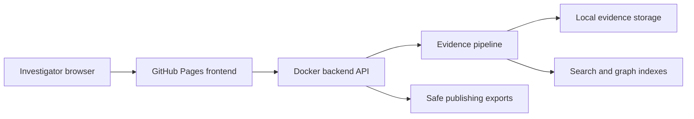

# Civitas


Live site: https://baditaflorin.github.io/civitas/

Repository: https://github.com/baditaflorin/civitas

Support the project: https://www.paypal.com/paypalme/florinbadita

Civitas is a civic investigation OS for turning leaked document dumps into searchable, analyzable, publishable evidence.


## Quickstart

```sh
make install-hooks
make dev
make build
make test
make smoke
```

## Architecture

Civitas uses a GitHub Pages frontend and a self-hosted Docker backend. The static frontend is public and safe to cache; the backend runs private ingestion, OCR, transcription, indexing, and redaction workflows against local evidence.



## Documentation

- Architecture decisions: https://github.com/baditaflorin/civitas/tree/main/docs/adr
- Architecture overview: https://github.com/baditaflorin/civitas/blob/main/docs/architecture.md
- API guide: https://github.com/baditaflorin/civitas/blob/main/docs/api.md
- Deployment guide: https://github.com/baditaflorin/civitas/blob/main/deploy/README.md
- Runbook: https://github.com/baditaflorin/civitas/blob/main/docs/runbook.md
- Postmortem: https://github.com/baditaflorin/civitas/blob/main/docs/postmortem.md

## Git Hooks

Run `make install-hooks` once after cloning. Hooks run local checks; this project intentionally does not use GitHub Actions.
