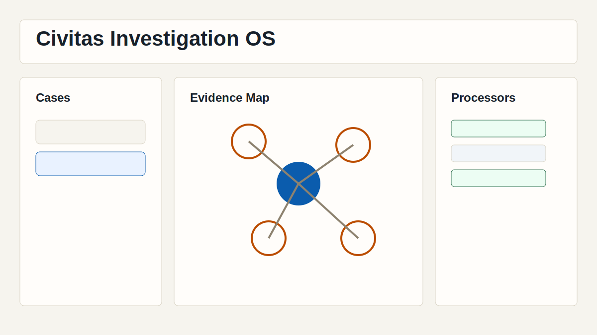
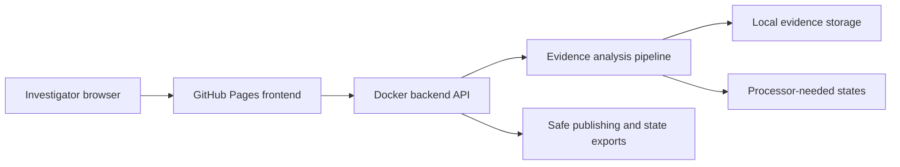

# Civitas


Live site: https://baditaflorin.github.io/civitas/

Repository: https://github.com/baditaflorin/civitas

Support the project: https://www.paypal.com/paypalme/florinbadita

Civitas is a civic investigation OS for turning messy evidence dumps into searchable, inspectable, safe-to-publish case work.



## Verified Features

- Create cases from the GitHub Pages app and connect them to a self-hosted backend.
- Upload one file, many files, dragged files, pasted text/HTML, or the bundled sample through the same ingestion path.
- Classify real civic evidence shapes including CSV, OCDS JSON, HTML articles, data-source pages, PDFs, scanned images, audio, ZIP archives, corrupt files, and empty transfers.
- Search, inspect document states, view a relationship map, and see timeline candidates from stored evidence.
- Generate safe markdown exports with provenance, confidence, redaction, source hashes, app version, and commit.
- Copy, download, and print safe exports; download/import versioned case state JSON for backup or migration.
- See the live app version and current GitHub commit on the published page.

## Quickstart

```sh
make install-hooks
make dev
make build
make test
make smoke
```

## Architecture

Civitas uses a GitHub Pages frontend and a self-hosted Docker backend. The static frontend is public and safe to cache; the backend keeps private evidence local, runs the current shape-aware analysis pipeline, and marks native-heavy work such as OCR/transcription as `needs_processor` until those processors are available.



## Limitations

- Direct URL scraping is not exposed in v0.3.0; paste rendered text/HTML or upload a saved file instead.
- Folder upload is not exposed; ZIP the folder and upload the archive.
- PDF text extraction is built in (pure-Go, no native dependencies) and runs by default. OCR, transcription, geospatial enrichment, face blurring, embeddings, and local LLM processing are still represented as processor states or future adapters unless the backend image is extended with those native tools. Image-only (scanned) PDFs land in `needs_processor` with the OCR processor message.
- Authentication is not built into v0.3.0; production deployments should protect the backend at the network/TLS layer.

## Documentation

- Architecture decisions: https://github.com/baditaflorin/civitas/tree/main/docs/adr
- Architecture overview: https://github.com/baditaflorin/civitas/blob/main/docs/architecture.md
- API guide: https://github.com/baditaflorin/civitas/blob/main/docs/api.md
- Deployment guide: https://github.com/baditaflorin/civitas/blob/main/deploy/README.md
- Runbook: https://github.com/baditaflorin/civitas/blob/main/docs/runbook.md
- Phase 2 postmortem: https://github.com/baditaflorin/civitas/blob/main/docs/postmortem-phase2-substance.md
- Phase 3 postmortem: https://github.com/baditaflorin/civitas/blob/main/docs/postmortem-phase3.md

## Git Hooks

Run `make install-hooks` once after cloning. Hooks run local checks; this project intentionally does not use GitHub Actions.
