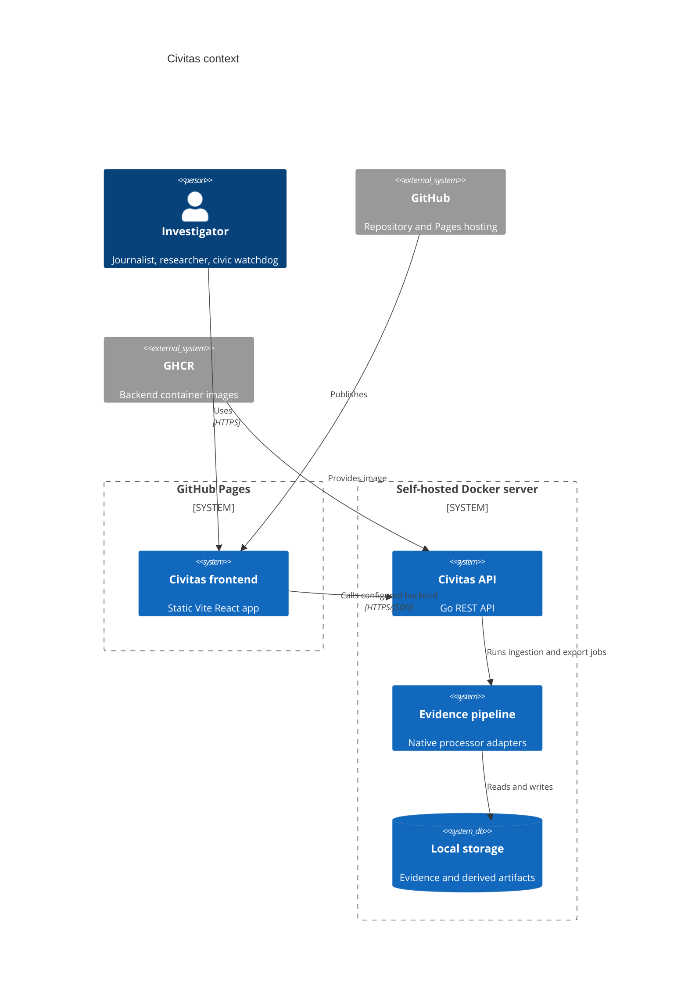
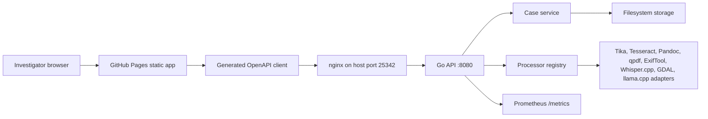

# Civitas Architecture

Live site:

https://baditaflorin.github.io/civitas/

Repository:

https://github.com/baditaflorin/civitas

## Context

## Containers

## Module Boundaries

- `frontend`: `src/` plus Vite config, built into `docs/`.
- `api`: OpenAPI contract consumed by generated frontend types.
- `cmd/server`: backend entrypoint and graceful shutdown.
- `internal/httpapi`: routing, handlers, JSON responses, CORS, metrics.
- `internal/pipeline`: processor registry and v1 extraction orchestration.
- `internal/storage`: filesystem case, document, graph, timeline, and export storage.
- `deploy`: production Docker Compose, nginx, Prometheus, and run instructions.
