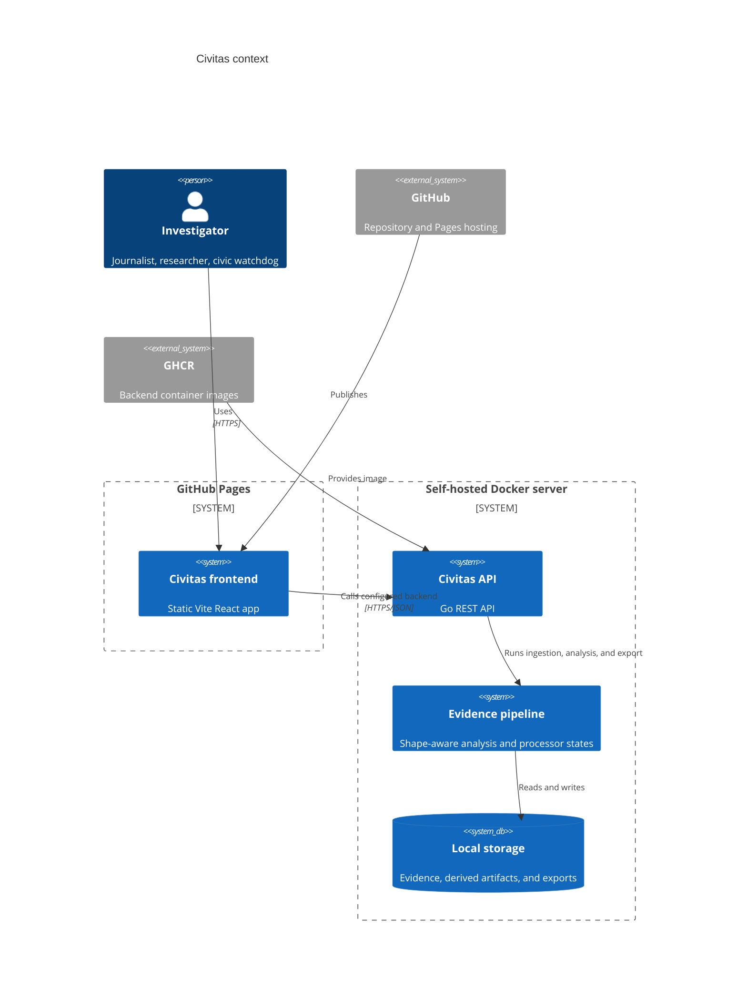
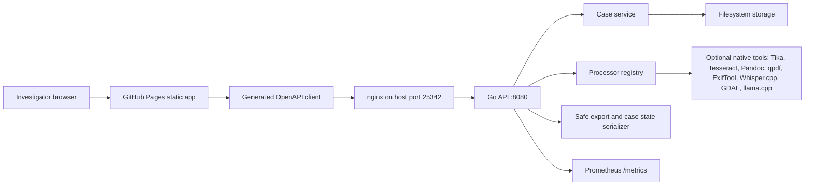

# Civitas Architecture

Live site:

https://baditaflorin.github.io/civitas/

Repository:

https://github.com/baditaflorin/civitas

## Context

## Containers

## Module Boundaries

- `src/`: static React frontend, built into `docs/` for GitHub Pages.
- `src/lib/api`: generated OpenAPI client types plus small boundary helpers.
- `src/lib/session`: browser session preference storage and migration surface.
- `api/openapi.yaml`: REST contract consumed by the frontend.
- `cmd/server`: backend entrypoint and graceful shutdown.
- `internal/httpapi`: routing, handlers, JSON responses, CORS, metrics.
- `internal/pipeline`: evidence shape classification, inference, confidence, and processor-needed states.
- `internal/exporter`: safe markdown export and portable case-state serialization.
- `internal/storage`: filesystem case, document, export, and state import storage.
- `deploy`: production Docker Compose, nginx, Prometheus, and run instructions.
